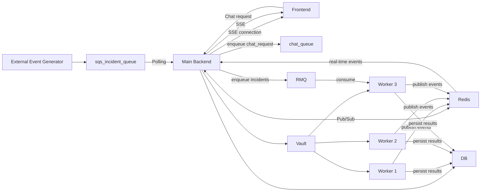

# Infra AI Backend

FastAPI service for incident intake, automated remediation workflows, CMDB operations, chat/tool orchestration, and external integrations.

## What this project provides

- Incident ingestion endpoints (`/incidentAdd`, `/incidents/add`)
- SQS-backed worker processing for incident analysis/remediation
- Real-time incident execution streams via SSE (`/incident/stream`, `/api/v1/incidents/stream`)
- CMDB and service inventory APIs
- Knowledge base ingestion/search APIs
- Chat APIs with tool integrations (ServiceNow, GitHub, Jira, Confluence, PagerDuty, Prometheus, Datadog)
- Admin/workflow APIs (approvals, alert types, escalation rules, jobs)

## Tech stack

- Python 3.11
- FastAPI
- Supabase
- AWS (SQS, optional ECS/S3 for automation sandbox)
- OpenRouter / Gemini connectors
- Pinecone
- Redis
- Infisical
- Slack SDK + other integration clients

## Architecture overview

The backend centers on a FastAPI service that accepts chat and incident traffic, coordinates queue workers, streams updates to the frontend, and publishes work to supporting systems.



### Runtime responsibilities

- `Frontend` sends chat and incident requests and listens for live SSE updates.
- `Main Backend` orchestrates queueing, persistence, secret access, and worker coordination.
- `Redis` acts as the pub/sub backbone for worker updates.
- `Vault` provides credentials and secret material to the backend and workers.
- `RMQ`, `chat_queue`, and `sqs_incident_queue` decouple intake from asynchronous processing.
- `DB` stores incidents, workflow state, and generated outputs.

## Repository layout

- `main.py`: FastAPI application entrypoint and top-level app wiring
- `worker.py`: incident worker loop and queue processing
- `app/api/routers/`: modular API routers for incidents, chat, SSE, admin, workflow, and integration config
- `app/core/`: config, auth/security, middleware, DB access, logging, encryption, and SSE helpers
- `app/schemas/`: shared request/response and domain schemas
- `app/services/`: incident, notification, and RCA service logic
- `integrations/`: adapters for ServiceNow, GitHub, Jira, Confluence, PagerDuty, Prometheus, Slack, Infisical, and related tools
- `migrations/`: SQL migrations for RBAC, CMDB, integrations, jobs, incidents, workflow, and performance indexes
- `scripts/`: operational helpers, including the Ansible sandbox runner
- `tests/`: unit, integration, service, and verification tests
- `docs/`: backend-specific architecture and feature notes
- `Deployment/` and `Dockerfiles/`: legacy/deployment automation assets

## Prerequisites

- Python 3.11+
- Access to Supabase project and tables used by this service
- AWS credentials with access to configured SQS queues
- Clerk setup for JWT issuance/verification
- Optional but commonly required: OpenRouter, Pinecone, Infisical, Redis

## Local setup

```bash
cd infra-ai-backend
python -m venv .venv
source .venv/bin/activate
pip install -r requirements.txt
cp .env.example .env
```

For local validation tooling:

```bash
pip install -r requirements-dev.txt
```

## Environment variables

Start from `.env.example` and add real secrets.

Important: the current code still reads some legacy env names from `app/core/config.py`. To avoid startup surprises, set both normalized and legacy names for these keys:

- OpenRouter: `OPENROUTER_API_KEY` and `openrouter`
- Pinecone: `PINECONE_API_KEY` and `Pinecone_Api_Key`
- AWS: `AWS_ACCESS_KEY_ID`/`AWS_SECRET_ACCESS_KEY` and `access_key`/`secrete_access`
- Infisical: `INFISICAL_CLIENT_ID`/`INFISICAL_CLIENT_SECRET` and `clientId`/`clientSecret`

Core variables typically needed:

- `SUPABASE_URL`
- `SUPABASE_KEY`
- `SQS_QUEUE_NAME`
- `WORKER_COUNT`
- `CHAT_WORKER_COUNT`
- `OPENROUTER_MODEL`
- `CLERK_SECRET_KEY`

## Run locally

```bash
fastapi dev main.py --host 0.0.0.0 --port 8000
```

Alternative:

```bash
uvicorn main:app --reload --host 0.0.0.0 --port 8000
```

OpenAPI docs:

- `http://localhost:8000/docs`

## Worker behavior

- Incidents are inserted, then enqueued to SQS from `/incidentAdd` or `/incidents/add`
- Worker loop consumes queue messages and updates incidents/jobs/results
- Worker and chat worker thread counts are controlled by:
  - `WORKER_COUNT`
  - `CHAT_WORKER_COUNT`

## Key API groups

- Incidents:
  - `POST /incidentAdd`
  - `POST /incidents/add`
  - `GET /allIncidents`
  - `GET /getIncidentsDetails/{inc_number}`
  - `GET /getResults/{inc_number}`
- Streaming:
  - `POST /incident/stream`
  - `GET /api/v1/incidents/stream/{inc_number}`
- Chat:
  - `POST /chat`
  - `POST /chat/stream`
  - `POST /chat/async`
  - `GET /chat/async/{job_id}`
- CMDB/Services:
  - `GET/POST /cmdb`
  - `GET/PUT/DELETE /cmdb/{tag_id}`
  - `GET/POST /services`
- Admin/Workflow:
  - `GET/POST/PUT/DELETE /alert-types`
  - `GET/POST/PUT/DELETE /escalation-rules`
  - `POST /pending-actions/{action_id}/approve|reject`

## Migrations

SQL migrations are in `migrations/`. Apply them in your DB deployment pipeline before rolling out new backend code.

## Docker

```bash
docker build -t infra-ai-backend .
docker run --env-file .env -p 8000:8000 infra-ai-backend
```

## Testing and delivery

Local quality checks:

```bash
ruff format --check app/core/logger.py app/core/sse_manager.py app/core/supabase_timeout.py tests
pytest
```

GitHub Actions pipeline:

- `test` job installs `requirements-dev.txt`, checks formatting, and runs the pytest suite on pull requests and pushes to `main`.
- `docker` job runs after tests pass on `main` and publishes a Docker image to GitHub Container Registry at `ghcr.io/<owner>/infra-ai-backend`.

## Logs and troubleshooting

- Main log files commonly used during local runs:
  - `infra_backend.log`
  - `infra_worker.log`
- Queue health endpoint:
  - `GET /worker/queue-health`
- If incidents stay queued:
  - Verify `SQS_QUEUE_NAME`
  - Verify AWS credentials and queue permissions
  - Verify worker threads are running

## Demo and screenshots


https://github.com/user-attachments/assets/4da34f15-ea2c-48da-90ce-59e0e490b84a


